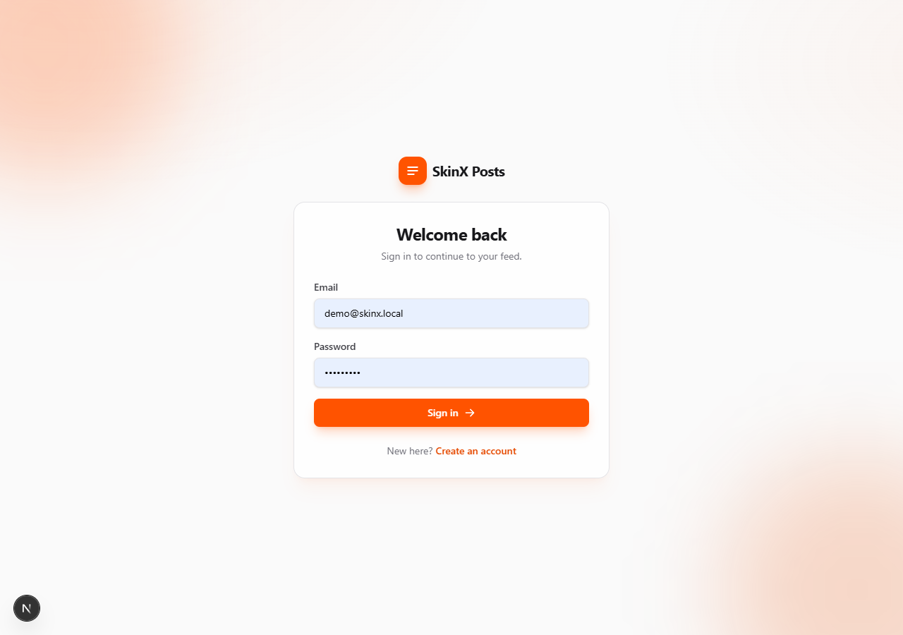
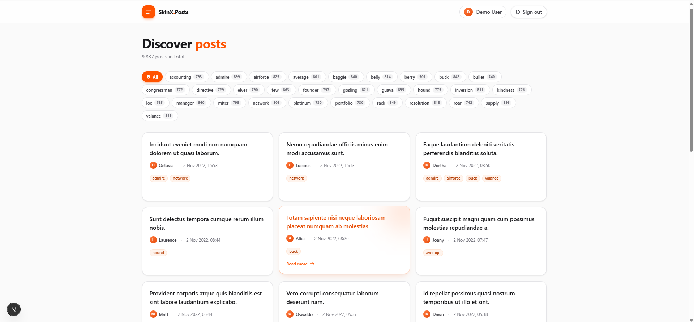

# SkinX Posts — Full-stack Assessment

A full-stack reading app built around the 9,837-post `posts.json` dataset. Node.js + PostgreSQL backend, Next.js 16 frontend, designed with security and performance in mind.

> 🇹🇭 ภาษาไทย: [README.th.md](README.th.md)




## Stack

| Layer     | Tech                                                                    |
| --------- | ----------------------------------------------------------------------- |
| Database  | PostgreSQL 16 (Docker)                                                  |
| ORM       | Prisma 5                                                                |
| Backend   | Node.js 20, Express, TypeScript, Zod, JWT sessions, bcrypt              |
| Frontend  | Next.js 16 (App Router, Turbopack), React 19, Tailwind CSS v4           |
| Security  | helmet, rate-limit, per-email lockout, BREACH-safe gzip, DOMPurify      |
| Tests     | Vitest, supertest — 48 tests across backend + frontend                  |

## Project layout

```
.
├── backend/
│   ├── prisma/
│   │   ├── schema.prisma               # User, Session, Post, Tag, PostTag
│   │   └── migrations/                 # 2 migrations (init + sessions)
│   ├── src/
│   │   ├── config/env.ts               # Zod-validated env loader
│   │   ├── db/client.ts                # Prisma singleton (hot-reload safe)
│   │   ├── middleware/                 # auth, validate, error, notFound
│   │   ├── modules/
│   │   │   ├── auth/                   # routes → controller → service
│   │   │   │   ├── auth.{routes,controller,service,schema}.ts
│   │   │   │   └── lockout.ts          # per-email brute-force tracker
│   │   │   └── posts/                  # routes → controller → service → repository
│   │   ├── scripts/seed.ts             # idempotent seed (batched createMany)
│   │   ├── utils/                      # jwt, hash, errors, logger, asyncHandler
│   │   ├── app.ts                      # Express assembly (helmet, compression…)
│   │   └── index.ts                    # entry + graceful shutdown
│   ├── tests/
│   │   ├── helpers/                    # setup, factories, supertest wrapper
│   │   ├── auth.test.ts                # 18 tests
│   │   ├── posts.test.ts               # 12 tests
│   │   ├── lockout.test.ts             # 2 tests
│   │   └── utils.test.ts               # 5 tests (hash, jwt)
│   ├── .env.example
│   ├── .env.test
│   ├── vitest.config.ts
│   └── tsconfig.json
│
├── frontend/
│   ├── src/
│   │   ├── app/
│   │   │   ├── api/auth/clear/         # Route handler to clear stale cookie
│   │   │   ├── login/                  # page + server action + client form
│   │   │   ├── register/               # page + server action + client form
│   │   │   ├── posts/
│   │   │   │   ├── [id]/               # detail + not-found
│   │   │   │   ├── page.tsx            # list + filter + pagination
│   │   │   │   ├── layout.tsx          # header/nav, auth-protected
│   │   │   │   ├── loading.tsx         # skeleton shimmer
│   │   │   │   ├── error.tsx           # error boundary
│   │   │   │   ├── not-found.tsx       # posts-scoped 404
│   │   │   │   └── logout-action.ts    # server action
│   │   │   ├── globals.css             # Tailwind v4 theme tokens + animations
│   │   │   ├── layout.tsx              # root
│   │   │   ├── not-found.tsx           # global 404
│   │   │   └── page.tsx                # redirects to /posts
│   │   ├── components/                 # PostCard, TagFilter, Pagination, LogoutButton
│   │   ├── lib/
│   │   │   ├── api.ts                  # server-only API client
│   │   │   ├── auth.ts                 # cookie helpers
│   │   │   ├── sanitize.ts             # sanitize-html whitelist
│   │   │   ├── format.ts               # date formatter (Asia/Bangkok)
│   │   │   ├── types.ts                # shared types
│   │   │   └── env.ts                  # BACKEND_API_URL
│   │   └── proxy.ts                    # Next 16 proxy (route protection + 404 guard)
│   ├── tests/
│   │   ├── helpers/server-only-stub.ts
│   │   ├── sanitize.test.ts            # 9 tests
│   │   └── format.test.ts              # 2 tests
│   ├── .env.example
│   ├── next.config.ts
│   ├── postcss.config.mjs
│   ├── vitest.config.ts
│   └── tsconfig.json
│
├── posts.json                          # seed source (9,837 posts)
├── docker-compose.yml                  # PostgreSQL
├── README.md                           # you are here
└── README.th.md
```

## Prerequisites

- **Node.js** >= 20
- **Docker** + **Docker Compose** (for local PostgreSQL)
- **npm** (or pnpm / yarn)

## First-time setup

```bash
# 1. Start PostgreSQL
docker compose up -d

# 2. Backend
cd backend
cp .env.example .env
# Generate a real JWT_SECRET and paste it into .env:
node -e "console.log(require('crypto').randomBytes(48).toString('base64url'))"
npm install
npm run prisma:migrate              # applies 2 migrations
npm run seed                        # creates demo user + 9,837 posts
npm run dev                         # http://localhost:4000

# 3. Frontend (new terminal)
cd frontend
cp .env.example .env.local
npm install
npm run dev                         # http://localhost:3000
```

**Demo login** (created by seed):

| field    | value                |
| -------- | -------------------- |
| email    | `demo@skinx.local`   |
| password | `Demo@1234`          |

Open http://localhost:3000 and sign in.

## HTTP API

All routes under `/api/*`. Auth via `skinx_token` cookie (httpOnly, SameSite=Lax) or `Authorization: Bearer <jwt>` header.

| Method | Path                              | Auth | Description                                       |
| ------ | --------------------------------- | ---- | ------------------------------------------------- |
| GET    | `/health`                         | no   | Liveness probe                                    |
| POST   | `/api/auth/register`              | no   | Create user + issue session                       |
| POST   | `/api/auth/login`                 | no   | Verify credentials + issue session                |
| POST   | `/api/auth/logout`                | yes  | Revoke current session                            |
| GET    | `/api/auth/me`                    | yes  | Return session user                               |
| GET    | `/api/posts`                      | yes  | List posts — `?page=&pageSize=&tag=&q=`           |
| GET    | `/api/posts/tags`                 | yes  | All tags with post counts                         |
| GET    | `/api/posts/:id`                  | yes  | Post detail (includes HTML content)               |

Error shape:

```json
{ "error": { "code": "CONFLICT", "message": "Email is already registered", "details": { ... } } }
```

## Scripts

### Backend

```bash
npm run dev                 # tsx watch
npm run build               # tsc → dist/
npm run start               # node dist/index.js
npm run prisma:migrate      # create + apply dev migration
npm run prisma:deploy       # apply pending migrations (prod)
npm run prisma:studio       # GUI for the database
npm run seed                # seed posts.json + demo user
npm run typecheck           # tsc --noEmit
npm run test:setup          # apply migrations to test DB (first time)
npm test                    # run vitest once
npm run test:watch          # watch mode
```

### Frontend

```bash
npm run dev                 # next dev (Turbopack)
npm run build               # next build
npm run start               # next start (production)
npm run lint                # next lint
npm run typecheck           # tsc --noEmit
npm test                    # vitest (sanitize, format)
npm run test:watch
```

## Environment variables

### `backend/.env`

| var                    | required | default                            | purpose                                           |
| ---------------------- | -------- | ---------------------------------- | ------------------------------------------------- |
| `DATABASE_URL`         | ✓        | —                                  | Postgres connection string                        |
| `PORT`                 |          | `4000`                             | HTTP port                                         |
| `NODE_ENV`             |          | `development`                      | `development` / `test` / `production`             |
| `LOG_LEVEL`            |          | `info`                             | pino log level                                    |
| `JWT_SECRET`           | ✓        | —                                  | HS256 secret (min 32 chars — **generate yourself**) |
| `JWT_EXPIRES_IN`       |          | `7d`                               | Token lifetime                                    |
| `CORS_ORIGIN`          |          | `http://localhost:3000`            | Comma-separated allowed origins                   |
| `TRUST_PROXY`          |          | `false`                            | Express trust proxy — **do NOT set to `true`** in prod unless behind a trusted proxy |
| `SEED_FILE_PATH`       |          | `../posts.json`                    | Path to seed JSON relative to cwd                 |
| `SEED_DEMO_EMAIL`      |          | `demo@skinx.local`                 | Demo user email                                   |
| `SEED_DEMO_PASSWORD`   |          | `Demo@1234`                        | Demo user password                                |

`backend/.env.test` mirrors the above but points `DATABASE_URL` at `skinx_posts_test` and uses a fixed JWT secret.

### `frontend/.env.local`

| var               | required | default                  | purpose                          |
| ----------------- | -------- | ------------------------ | -------------------------------- |
| `BACKEND_API_URL` | ✓        | `http://localhost:4000`  | Server-side-only (no `NEXT_PUBLIC_`) |

## Testing

- **Backend** — Vitest + supertest. Uses a **separate `skinx_posts_test` database** (Docker Postgres). Truncates tables + resets caches + clears lockout between tests.
- **Frontend** — Vitest for pure-function tests (HTML sanitizer, date formatter).
- **Total**: 48 tests — run `npm test` in each directory.

First-time test DB setup:

```bash
docker exec skinx_postgres psql -U skinx -d skinx_posts -c "CREATE DATABASE skinx_posts_test;"
cd backend && npm run test:setup
```

## Architecture & design decisions

### Data model

```
User ─┬─ Session (jti; expiresAt, revokedAt)
      └─ (no authored posts — posts predate user accounts)

Post ─── PostTag ─── Tag     # many-to-many, indexed on tagId
```

### Layered backend

```
HTTP  →  middleware  →  routes  →  controller  →  service  →  repository  →  Prisma
```

- **Controller** is 3–5 lines: unpack req → service → send response.
- **Service** holds business rules (throw `NotFound`, calc `totalPages`, rate-limit by email, bcrypt with dummy-hash compare to avoid timing oracle).
- **Repository** is the only place that talks to Prisma for posts; easy to swap ORM in one place.
- **Schema** (Zod) is single source of truth for DTO types.

### Auth

- **JWT HS256** + **server-side Session table** — JWT `jti` claim references a `Session` row; logout sets `revokedAt`, middleware rejects revoked tokens. Stateless scaling + real revocation.
- **Timing-safe login** — bcrypt compare runs against a dummy hash when the email doesn't exist, so response time doesn't leak user enumeration.
- **Per-email lockout** — 5 failures in 15 minutes locks that email, regardless of source IP. Counters complement the IP rate limit to defeat rotating-proxy credential stuffing.
- **httpOnly + SameSite=Lax + Secure (prod)** cookie — JWT never reaches JS, CSRF mitigated by SameSite.

### Security hardening

- **Helmet** with explicit opts (CSP off for JSON API, CORP `same-site`).
- **Rate limit** — 300 req/min global; 20 req/15min on `/api/auth/*`. Both skipped in tests.
- **CORS whitelist** — allowed origins are explicit; `credentials: true` for cookie auth.
- **Gzip compression** with filter that **excludes `/api/auth/*`** — eliminates the BREACH attack surface on responses containing JWTs.
- **`trust proxy`** is opt-in via env to prevent `X-Forwarded-For` spoofing → rate-limit bypass.
- **HTML sanitization** — `sanitize-html` whitelist on the frontend before `dangerouslySetInnerHTML`; auto-adds `rel="noopener noreferrer" target="_blank"` to all `<a>`; blocks `javascript:` and `data:` URLs.
- **CSP + HSTS** set only in production (Next dev mode uses inline scripts).
- **Password policy** — min 8 chars, must include letters + numbers + a symbol.
- **Open-redirect protection** — login `next` query rejected if not a clean absolute path.
- **Proxy-level 404** — malformed `?page=` query returns real HTTP 404 (Next 16 quirk workaround).

### Performance

- **Indexed queries** — `Post.postedAt desc`, `Post.postedBy`, `PostTag.tagId`, `Session.userId`, `Session.expiresAt`.
- **Server-enforced pagination** — default 20, max 100 per page.
- **In-memory caching** — `count()` result cache keyed by `tag+q` (60s TTL, bounded at 256 entries); tags list cache (5 min TTL).
- **Gzip** saves ~66% on large JSON responses (measured: 9.2KB → 3.1KB on `pageSize=50`).
- **Parallel data fetch** on the list page — `Promise.all([list, tags])`.
- **Batched seed** — 9,837 posts + 24,573 tag links inserted in ~7 seconds.

### Frontend design

- Tailwind v4 `@theme` tokens: **primary orange `#FF5300`** scale 50–900 + ink greyscale + secondary white.
- Custom keyframe animations: `fade-in`, `fade-in-up`, `scale-in`, `slide-in-right`, `shimmer`.
- `.stagger` utility for cascaded card entry.
- Honors `prefers-reduced-motion` (animations cut to near-zero).
- Server components by default; `'use client'` only for forms and buttons with local state.

### Route protection

`src/proxy.ts` (Next 16 renamed middleware) runs on Node runtime:

1. Redirects unauthenticated users from protected paths → `/login`.
2. Redirects authenticated users from `/login` or `/register` → `/posts`.
3. Validates `?page=` param — malformed values rewrite to `/not-found` with status **404**.

## Known limitations / next steps

- **Stateful lockout** — in-memory per-process. Swap for Redis when running multiple instances.
- **No session cleanup job** — expired/revoked rows in `sessions` grow. Add a daily cron: `DELETE FROM sessions WHERE expiresAt < NOW() OR revokedAt < NOW() - INTERVAL '7 days'`.
- **`q` search on `Post.title`** uses `ILIKE` without a `pg_trgm` GIN index. Fine for 9,837 rows; add trigram index if dataset grows.
- **No CSRF double-submit token** — relying on SameSite=Lax cookies. Add if targeting older browsers or very strict compliance.
- **No ESLint / Prettier config** in the backend.

## Troubleshooting

| Problem                                      | Fix                                                                             |
| -------------------------------------------- | ------------------------------------------------------------------------------- |
| `/api/posts/:id` → 500 in dev                | Clear `.next` cache (`rm -rf frontend/.next`), restart `npm run dev`            |
| Login returns 429 after testing              | In-memory lockout — wait 15 min or restart backend                              |
| `JWT_SECRET must be at least 32 chars`       | Generate one: `node -e "console.log(require('crypto').randomBytes(48).toString('base64url'))"` |
| Docker `DockerDesktop must be owned…` error  | Known Docker Desktop 4.68 issue: delete `C:\ProgramData\DockerDesktop` as admin |
| Browser has stale JWT after schema changes   | Visit `/api/auth/clear` — clears cookie and redirects to login                  |
